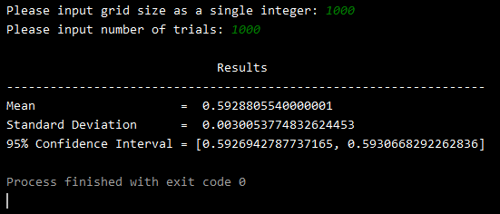
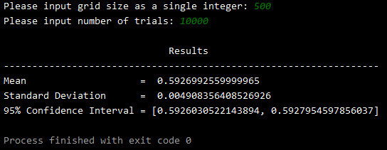
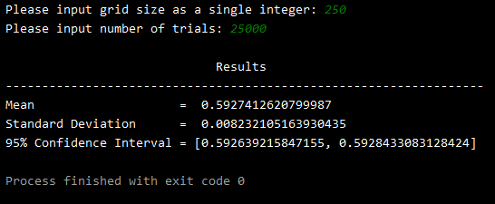

# Disclaimer
My contribution to this project was authoring the underlying Percolation Model API which is leveraged by the rest of the project (Percolation.java) & the program which runs a Monte Carlo simulation to estimate the percolation threshold value (PercolationStats.java).

All other project files apart from some screenshots of program output were written by the fine folks at Princeton University.

## Percolation
Given a composite system comprised of randomly distributed insulating and metallic materials, what fraction of the materials need to be metallic so that the composite system is an electrical conductor? Given a porous landscape with water on the surface (or oil below), under what conditions will the water be able to drain through to the bottom (or the oil to rise through to the surface)? Scientists have been able to model such situations using an abstract process known as percolation.

## The Model
We model a percolation system using an n-by-n grid of sites. Each site is either open or blocked. A full site is an open site that can be connected to an open site in the top row via a chain of neighboring (left, right, above, below) open sites. The system percolates if there is a full site in the bottom row. In other words, a system percolates if an open site in the top row of the grid is connected to an open site on the bottom row via a chain of other open sites. 

For the insulating/metallic materials example, the open sites correspond to metallic materials, so a system that percolates has a metallic path from top to bottom, with full sites acting as conductors. For the porous substance example, the open sites would correspond to empty space through which water might flow, such that a percolating system would let water fill open sites, flowing from the top row to bottom row of the grid.

  
  

Our model is achieved by implementing a Weighted Quick Union algorithm (imported from a Java library provided by Princeton University) to track the chains of connection between open sites in our grid.

## The Problem
In a famous scientific problem, researchers are interested in the following question: 
If sites are independently set to be open with probability p (and therefore blocked with probability 1 − p), what is the probability that the system percolates? When p equals 0, the system does not percolate; when p equals 1, the system percolates. The plots below show the site vacancy probability (probability of any given site being open) p versus the percolation probability for a 20-by-20 random grid (left) and a 100-by-100 random grid (right).

  
  

When n is sufficiently large, there is a threshold value p* such that when p < p* a random n-by-n grid almost never percolates, and when p > p*, a random n-by-n grid almost always percolates. No mathematical solution for determining the percolation threshold p* has yet been derived. Thus, the task of this program is to estimate p*. 

## The Solution (Monte Carlo Simulation)
To estimate the percolation threshold, the program conducts the following computational experiment:
* Initialize all sites in an n-by-n percolation system to be blocked
* Repeat the following steps until the system percolates:
  * Choose a site uniformly at random among all blocked sites
  * Open chosen site
* The fraction of open sites over total sites when the system percolates provides an estimate of the percolation threshold

For example, if sites are opened uniformly at random in a 20-by-20 grid, and the system percolates after opening the 204th site, then the estimate of the percolation threshold for that simulation would be 204/400 = 0.51

The program will simulate this experiment T number of times (inputted by the user), storing the p* estimation results from each simulation. The program then calculates the sample mean and sample standard deviation of the results and uses them to provide a 95% confidence interval for the percolation threshold.

## Results
The results of running the program (PercolationStats.java) with various grid-size inputs (examples pictured below) demonstrate the percolation threshold p* to be approximately 0.593.

  
  
  

## How To Use
 Compilation:  **javac InteractivePercolationVisualizer.java**
 Execution:    **java InteractivePercolationVisualizer n**
 where **n** is an integer representing the number of rows/columns, to display an interactive grid of n-by-n size. Clicking on a site in the grid will open the site, displaying it as white rather than black. Full sites will be displayed in blue, and an indicator will display when the system percolates.

 Compilation:  **javac PercolationVisualizer.java**
 Execution:    **java PercolationVisualizer exampleFile.txt**
 where **exampleFile.txt** is the name of a text file local to the project where the first line in the file contains an integer, n, representing the n-by-n dimensions of the grid, and each following line contains the space-separated row/column coordinates of the sites to be opened in the grid (see example input text files in project folder for examples).

Compilation:  **javac PercolationStats.java**
Execution:    **java PercolationStats**
The program will prompt the user for two inputs:
First, an integer representing the n-by-n grid size of the percolation system to to be simulated.
Second, the number of simulations to run.
The program will then run the aforementioned monte carlo simulation based on the user input and display the results to common output.