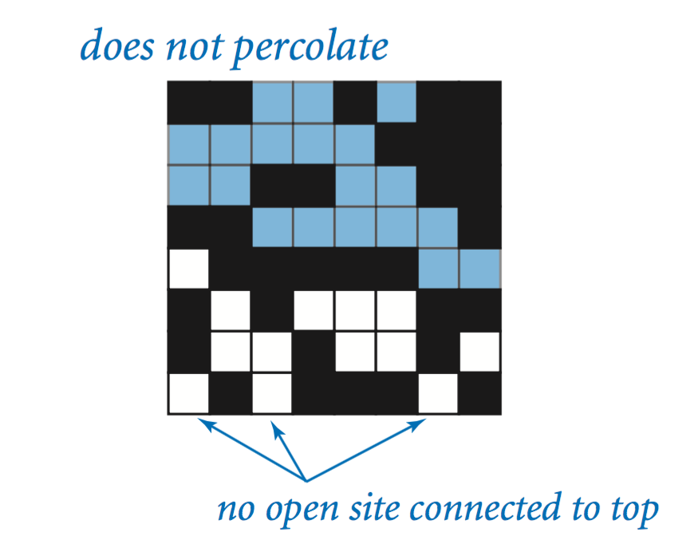

# Percolation Simulation
TODO: Add summary here

## Percolation
Given a composite system comprised of randomly distributed insulating and metallic materials, what fraction of the materials need to be metallic so that the composite system is an electrical conductor? Given a porous landscape with water on the surface (or oil below), under what conditions will the water be able to drain through to the bottom (or the oil to rise through to the surface)? Scientists have been able to model such situations using an abstract process known as percolation.

## The Model
We model a percolation system using an n-by-n grid of sites. Each site is either open or blocked. A full site is an open site that can be connected to an open site in the top row via a chain of neighboring (left, right, up, down) open sites. The system percolates if there is a full site in the bottom row. In other words, a system percolates if an open site in the top row of the grid is connected to an open site on the bottom row via a chain of other open sites. 

For the insulating/metallic materials example, the open sites correspond to metallic materials, so a system that percolates has a metallic path from top to bottom, with full sites acting as conductors. For the porous substance example, the open sites would correspond to empty space through which water might flow, such that a percolating system would let water fill open sites, flowing from the top row to bottom row of the grid.

                           |  
:-------------------------:|:-------------------------:
  |  

The implementation of this model is achieved by using a Weighted Quick Union data structure to track the chain of connection between open sites.

## The Problem
In a famous scientific problem, researchers are interested in the following question: 
If sites are independently set to be open with probability p (and therefore blocked with probability 1 − p), what is the probability that the system percolates? When p equals 0 (no sites are open), the system does not percolate; when p equals 1 (all sites are open), the system percolates.

When n is sufficiently large, there is a threshold value p* such that when p < p* a random n-by-n grid almost never percolates, and when p > p*, a random n-by-n grid almost always percolates. No mathematical solution for determining the percolation threshold p* has yet been derived. Thus, the task of this program is to estimate p*. 

## The Solution (Monte Carlo Simulation)
To estimate the percolation threshold, the program conducts the following computational experiment:
* Initialize all sites in an n-by-n percolation system to be blocked
* Repeat the following steps until the system percolates:
  * Choose a site uniformly at random among all blocked sites
  * Open chosen site
* The fraction of open sites over total sites when the system percolates provides an estimate of the percolation threshold

For example, if sites are opened uniformly at random in a 20-by-20 grid, and the system percolated after opening the 204th site, then the estimate of the percolation threshold for that simulation would be 204/400 = 0.51

The program will repeat this experiment T number of times (inputted by the user), storing the p* estimation results from each experiment. The program then calculates the sample mean and sample standard deviation of the results and uses them to provide a 95% confidence interval for the percolation threshold.

The results of the simulation demonstrate the percolation threshold to be ~0.593